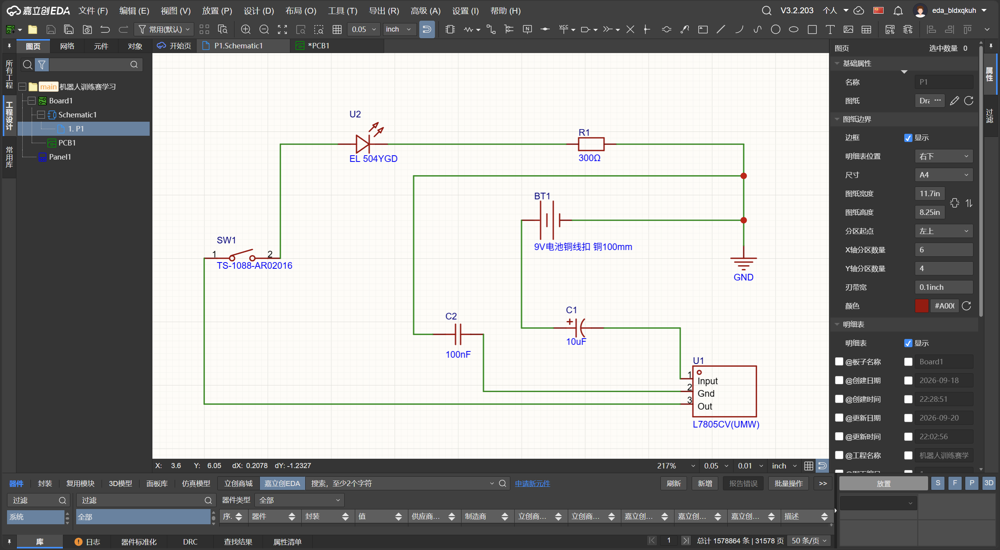

# CRTC机器人训练赛 - 硬件与EDA学习记录（Day 1）

## 🎯 今日目标
熟悉嘉立创EDA基础操作，理解电路回路，完成9V转5V稳压+按键控制LED原理图。

## 📚 今日学了什么
- **元件**：电容0.1µF=100nF；电阻直接放通用件改Value；LED长脚为正需限流；按键用四脚直插，无极性。
- **EDA**：快捷键`Shift+F`搜元件、`W`画线、`V`/`G`放电源地；画完必须跑ERC查悬空。
- **逻辑**：电流需电位差和闭合回路；开关接GND侧（低边开关）；滤波电容必须并联在电源与地之间。

## 🛠️ 实战电路
9V电池 -> L7805转5V -> LED正极 -> LED负极 -> 300Ω电阻 -> 按键 -> GND。
C1(10µF) 与 C2(100nF) 并联在电源和GND之间滤波。
