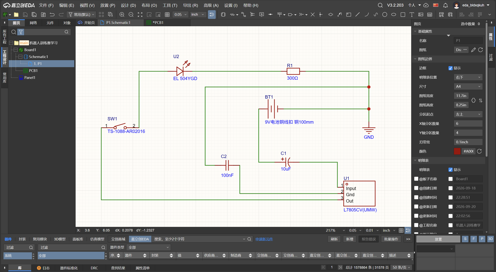
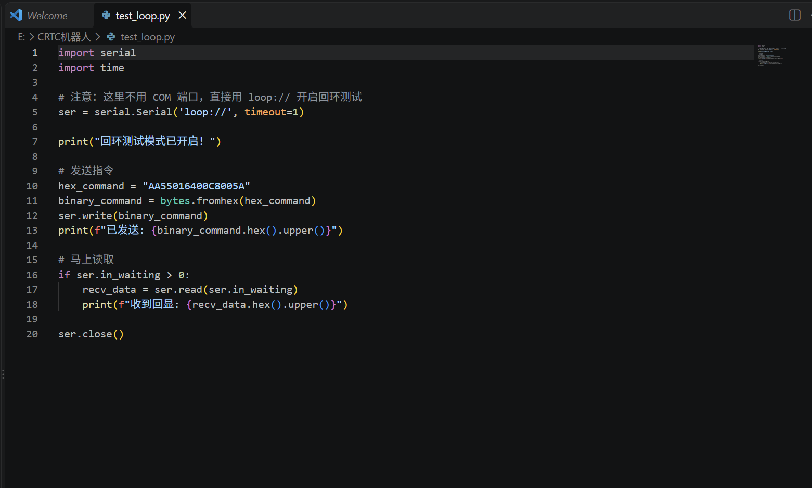

# CRTC机器人训练赛 
# 硬件与EDA学习记录（Day 1）
## 🎯 今日目标
熟悉嘉立创EDA基础操作，理解电路回路，完成9V转5V稳压+按键控制LED原理图。

## 📚 今日学了什么
- **元件**：电容0.1µF=100nF；电阻直接放通用件改Value；LED长脚为正需限流；按键用四脚直插，无极性。
- **EDA**：快捷键`Shift+F`搜元件、`W`画线、`V`/`G`放电源地；画完必须跑ERC查悬空。
- **逻辑**：电流需电位差和闭合回路；开关接GND侧（低边开关）；滤波电容必须并联在电源与地之间。
## 🛠️ 实战电路
9V电池 -> L7805转5V -> LED正极 -> LED负极 -> 300Ω电阻 -> 按键 -> GND。
C1(10µF) 与 C2(100nF) 并联在电源和GND之间滤波。


# 串口通信学习记录（Day 2）

> **目标**：搭建Python串口环境，理解收发原理，跑通虚拟回环测试。

## 📚 今日学了什么
- **环境搭建**：安装VS Code，Python 3.13，`pyserial`库（`pip install pyserial`）。
- **核心原理**：串口通信是比特流（0和1）转化为物理电压（0V/3.3V）的传输过程。接线必须**TX接RX，RX接TX，GND共地**。
- **调试技巧**：学会使用 `ser.in_waiting` 查看缓冲区，`ser.read()` 读取数据，以及 `data.hex().upper()` 将字节流转为可视十六进制。

## 🛠️ 实操记录
1. **虚拟回环**：在没有硬件的情况下，开启本地回环测试。
2. **发送测试**：发送十六进制指令 `AA55016400C8005A`。
3. **接收验证**：`in_waiting` 返回8，读取并成功打印出原指令，证明收发逻辑跑通。

## ⚠️ 踩坑与经验
1. **虚拟串口兼容性**：`com0com`下载困难，且`loop://`在Windows下不能直接用`serial.Serial()`，必须用`serial_for_url()`。

## 🚀 下一步
- [ ] 修改 `test_loop.py` 脚本文件，完成一键自动收发。
- [ ] 尝试别的路径下载com0com，用serial本地回环太复杂，后面和电控沟通代码会很麻烦。
- [ ] 与电控同学确定波特率和数据帧还有常用指令，准备与电控队友进行真实串口联调。


# 9.27串口学习内容
# Python 串口通信测试代码（虚拟串口 COM8 ↔ COM9）

## 环境说明
- 虚拟串口软件：VSPD（Virtual Serial Port Driver）
- 虚拟端口对：COM8（发送端）、COM9（接收端）
- 波特率：9600
- Python 库：pyserial
- 运行环境：PyCharm（或任意 Python 环境）

---

## 一、发送端代码（脚本1.py）

```python
import serial
import time

# 打开 COM8 发送数据
try:
    ser = serial.Serial('COM8', 9600, timeout=1)
    print("COM8 已打开，开始发送数据...")

    while True:
        ser.write(b'Hello from COM8!\n')
        print("已发送: Hello from COM8!")
        time.sleep(1)  # 每秒发一次

except serial.SerialException as e:
    print(f"打开 COM8 失败: {e}")
except KeyboardInterrupt:
    print("\n发送停止。")
    if 'ser' in locals() and ser.is_open:
        ser.close()
```
## 二、接收端代码（脚本2.py）

```python
import serial

# 打开 COM9 接收数据
try:
    ser = serial.Serial('COM9', 9600, timeout=1)
    print("COM9 已打开，等待接收数据...")

    while True:
        if ser.in_waiting > 0:
            data = ser.read(ser.in_waiting)
            print(f"COM9 收到: {data}")

except serial.SerialException as e:
    print(f"打开 COM9 失败: {e}")
except KeyboardInterrupt:
    print("\n接收停止。")
    if 'ser' in locals() and ser.is_open:
        ser.close()
```
## 三、注意事项
- 打开串口的代码必须放在**try 块**中，捕获 SerialException，否则程序容易闪退。
- 虚拟串口的端口号在不同电脑上可能不同，使用前务必去“设备管理器 → 端口 (COM 和 LPT)”**确认实际端口号**，并**同步修改代码**。