# 本周进度
本周我初步学习了solidworks的零件的基本用法，能够独立绘制草图或临摹其他复杂草图.
## 第一课：初试
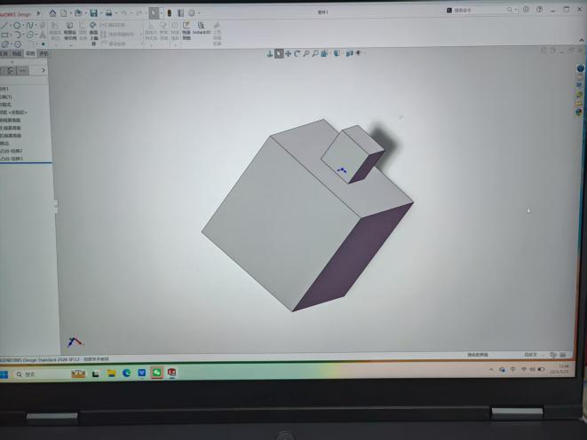
## 第二课：基本绘图方法及捷径
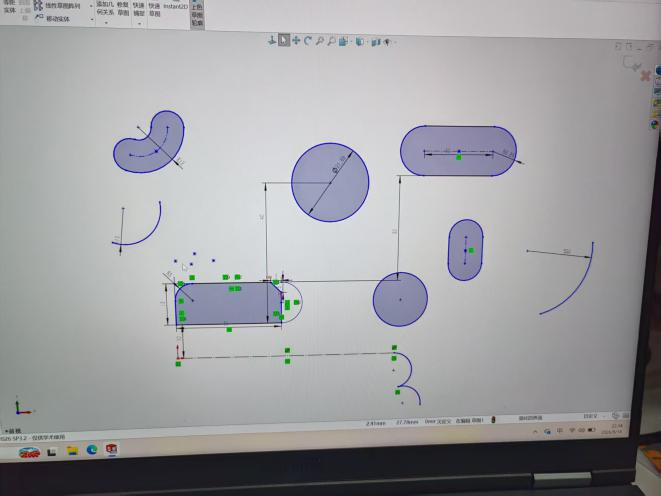

快捷方式还是右键长按最自在
那什么投影作图没听太懂，需要进一步的练习，多见题型就好了
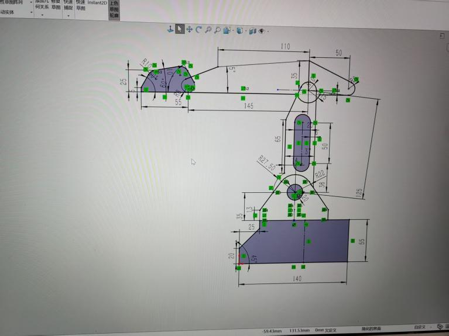
## 第三课：独立绘制草图练习对比原图的作图流程很痛苦，但我是唯结果论，不同的路线能够呈现同样的效果吧
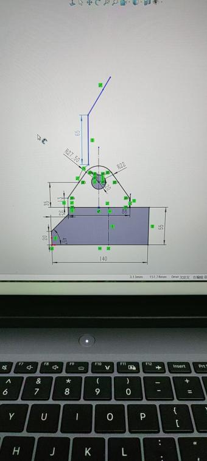
---

# 9.22学习进度
## 1.自己照着草图搓了一个枪哈哈
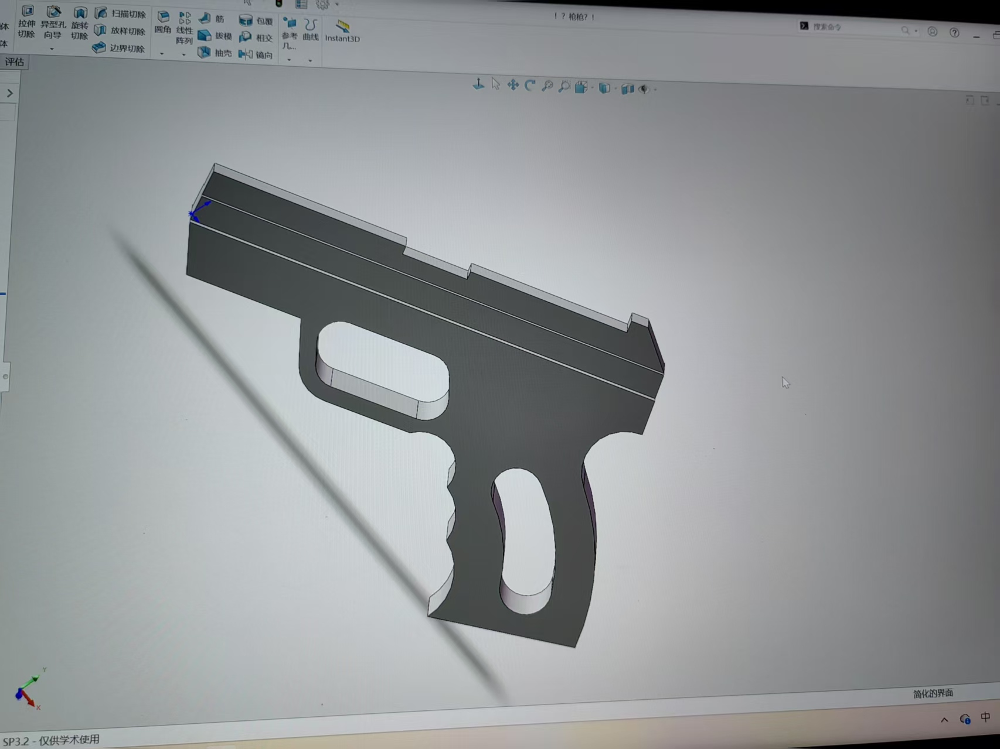
## 2.学习了拉伸凸台基体等技巧
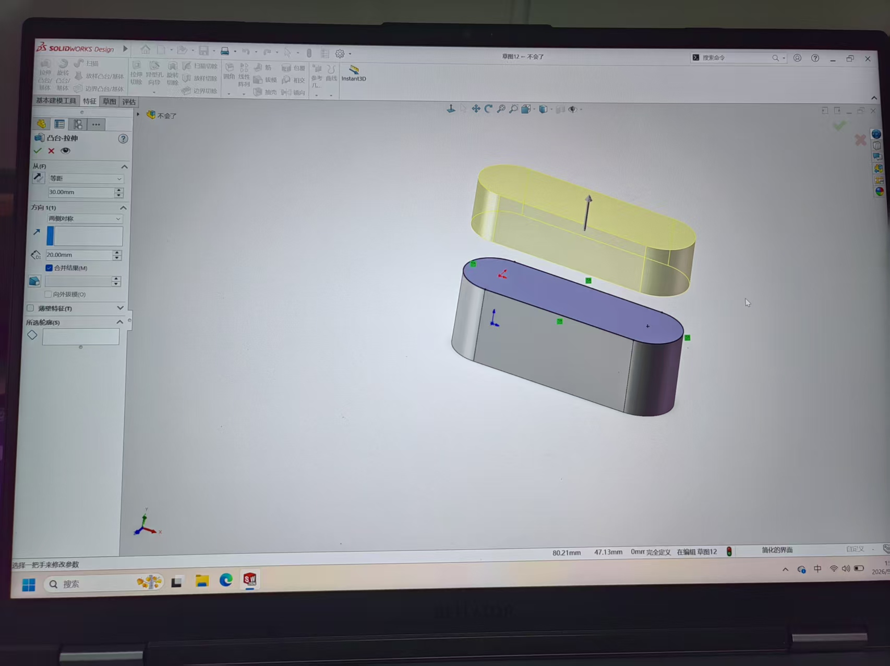
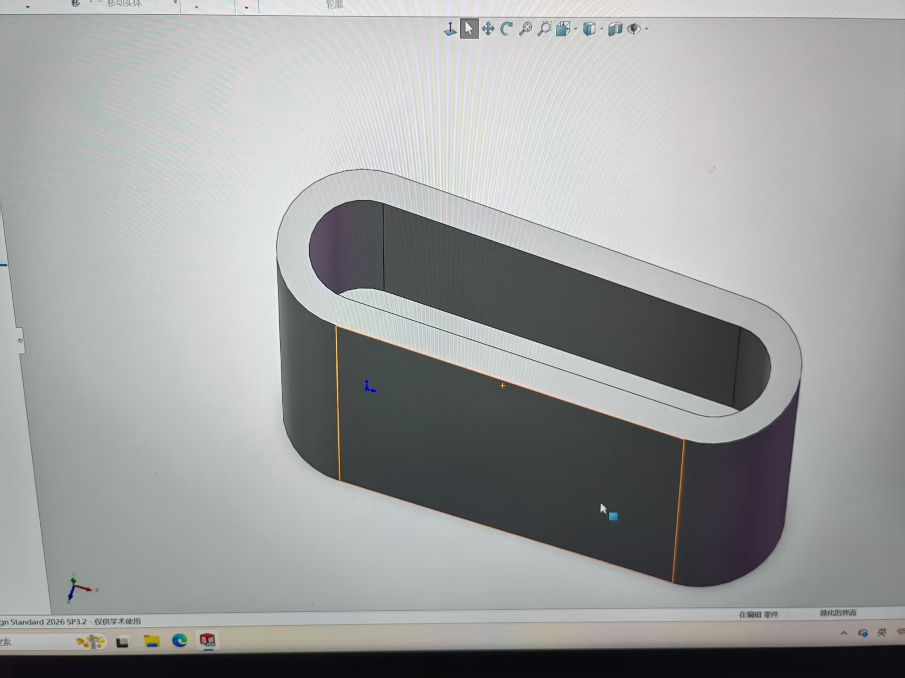
## 3.学习如何构建旋转凸台基体，以及弹簧的绘制
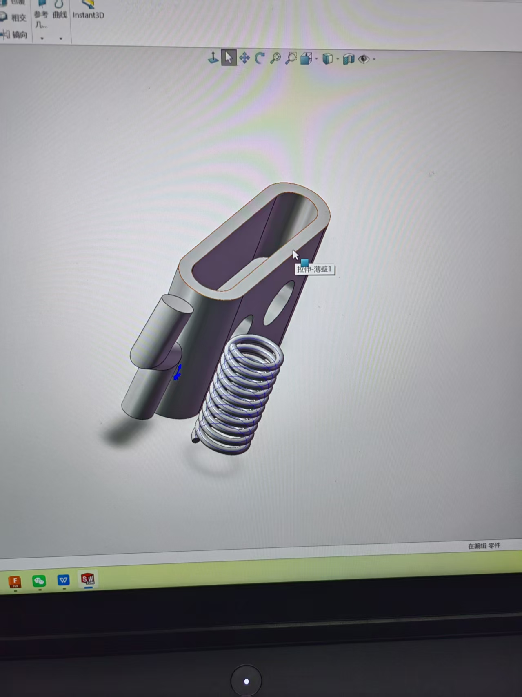

发现比赛官方更推荐fusion360,遂决定暂时搁置对solidworks的学习，以后有时间就两个一起学吧
---

# 9月25日fusion360进度
## 1.初学绘制草图，与solidworks如出一辙，非常简单
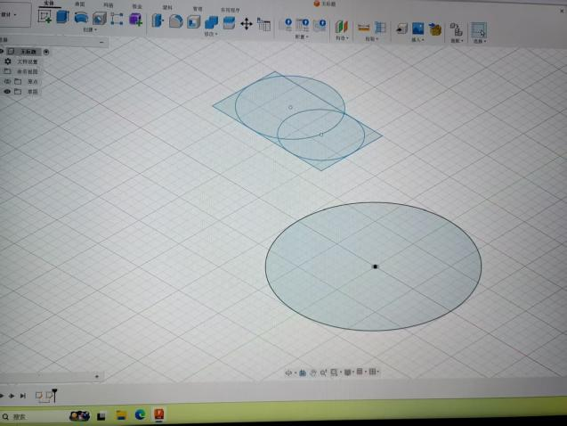
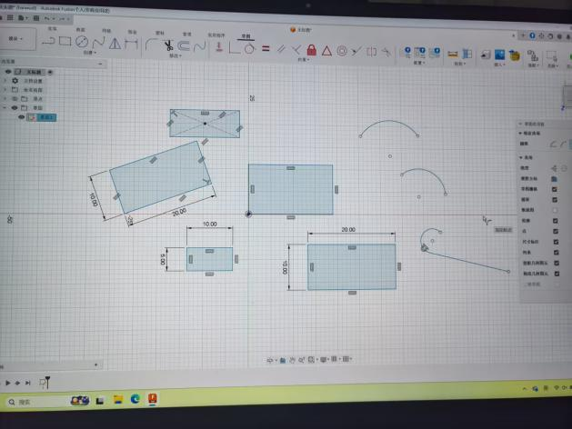
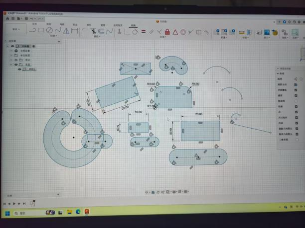
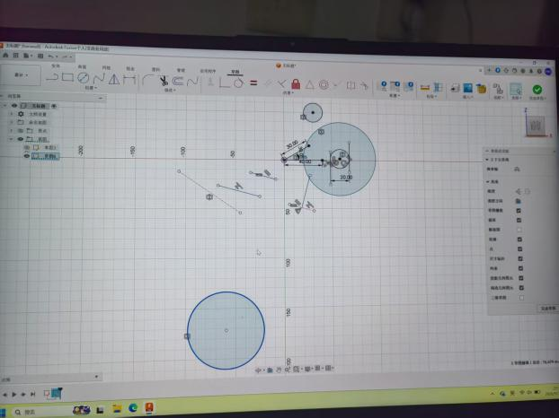

## 2画几个草图来练手
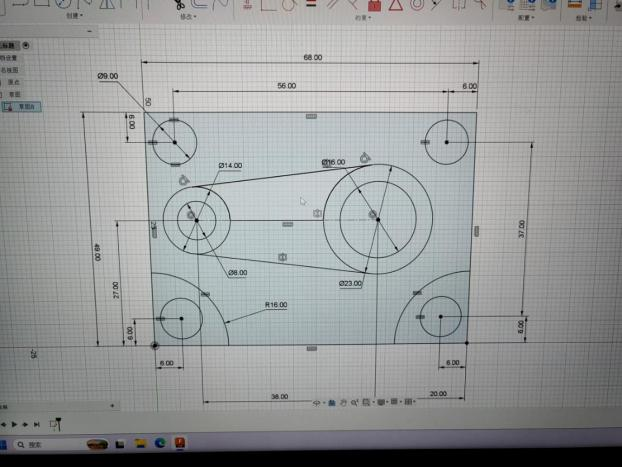

Fusion360难受死了，什么叫用了矩阵就没法标注尺寸？不标尺寸谁知道我是用的矩阵还是随便画几个圆杵在那里?
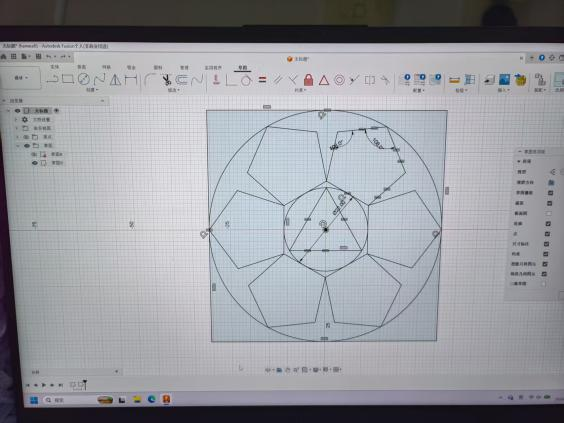
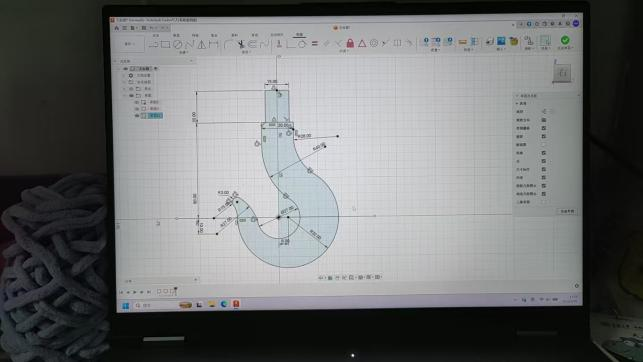

红温了总结fusion缺点：不严谨，在多个草图图案部分重合时，无法精确选出某个图案，比如两个点你不知道它是否重合，你也选不出来其中一个点，显示你的草图处于未完成状态，你也无法直接看出到底哪里未约束
---
# 9月28日进度
练习如何建造实体的各种功能，如构造平面，旋转，扫掠，筋等
## 1旋转
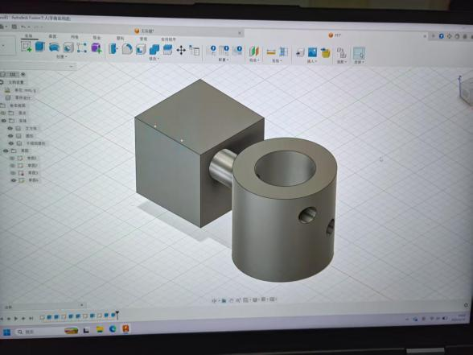
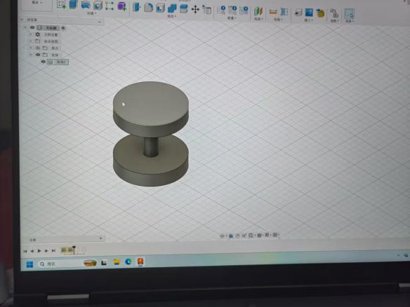
## 2筋
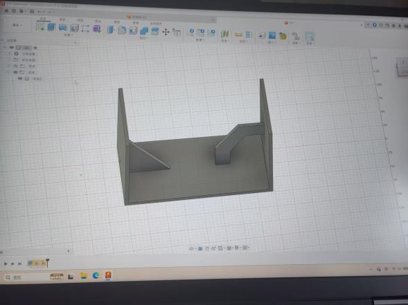
## 3 浮雕
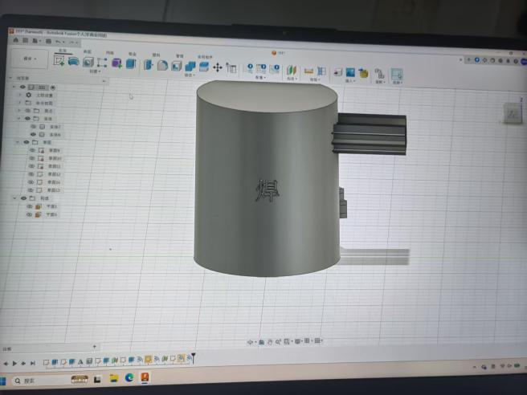

## 4实体练习
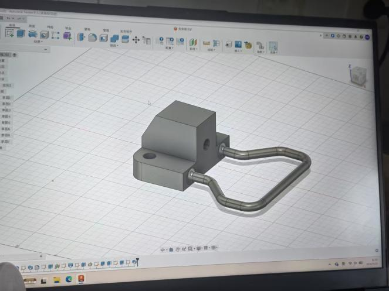
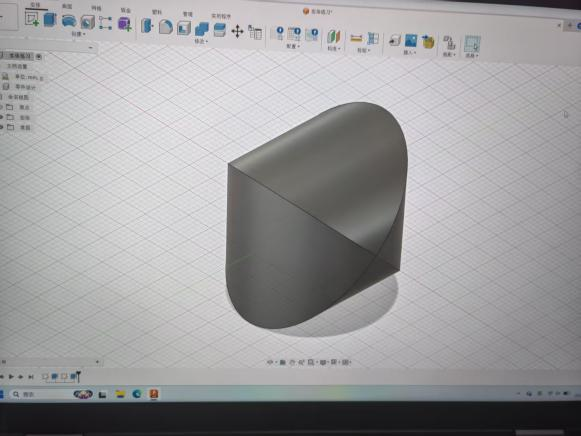
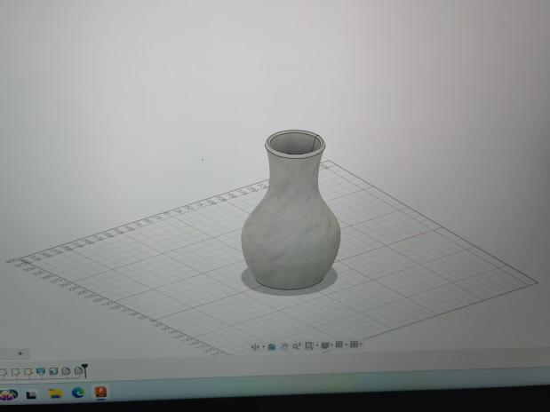
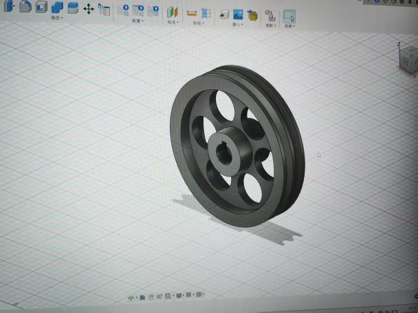
---

# 10月1日设计进度
## 第一辆车设计成十字扇叶+收集盒的结构，这是之前就定下来的。因为需要上坡且有宽度限制，最终把初始宽度缩减到原来的一半。
## 扇叶，轴和收集盒已在今天下午打印完毕，预计两天后能取出。正在设计第二辆小车。
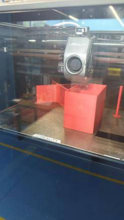

## 两辆车分工明确。经过讨论，第一辆车负责捡平地上以及坡上的方块；第二辆车需要精细，主要捡中央高台上的方块以及置物架上穿着的和洞里的方块。
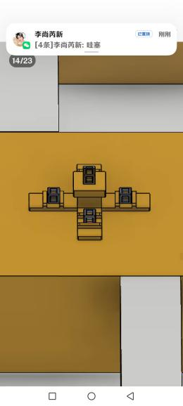
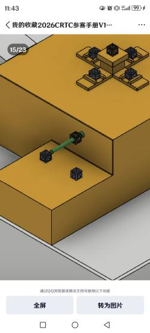
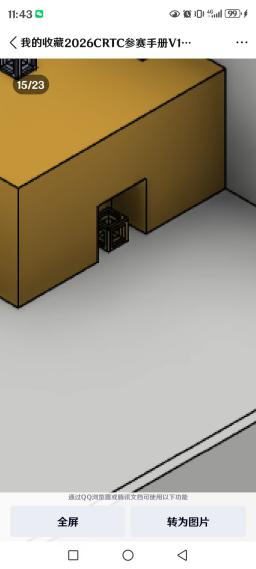

原先讨论是否要单设计一辆车作干扰对面行动，但因为速度要求太大就放弃了。我的思路是：一开始放置在高台上的车是辆四齿叉车，开局先直行一次性叉住高台上的4个方块，再用上面的灵活的叉子撸掉置物架上的方块，最后用下边的叉子的长端把洞里的勾出来。下三个叉连在一起，使用两个舵机；最上面的一个叉使用2个舵机以便灵活旋转。不需要收集盒，叉子可以设计的足够长，然后用滑轨进行前后伸缩和左右移动。滑轨技术经deepseek指导，决定使用传送带，具体思路不明，预计后续完成。
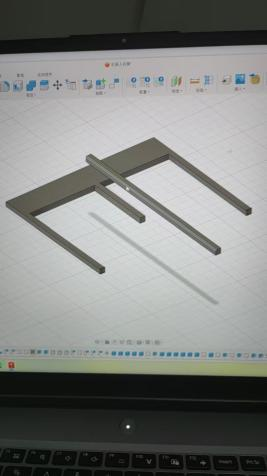

## 另附上我爸的想法
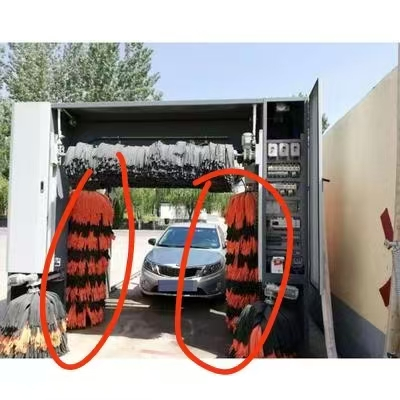