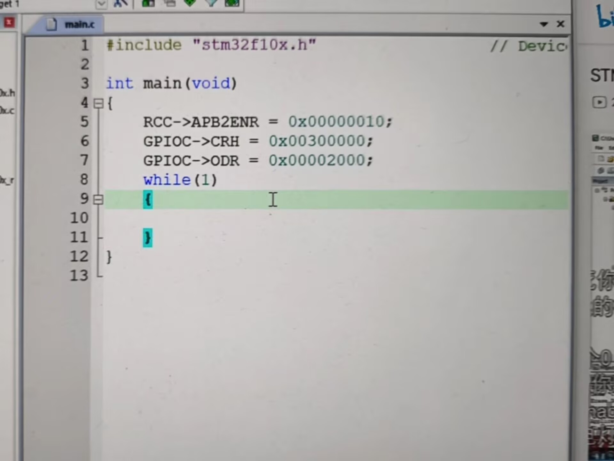
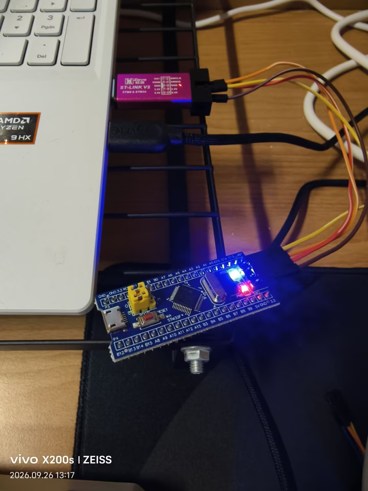

## 9.26
> 今日学习目标：STM32寄存器版GPIO点灯，熟悉Keil工程配置、ST‑Link烧录接线

### 一.今日完成学习项目
1. 看懂STM32寄存器点灯完整代码，理解RCC、GPIO相关寄存器作用
2. 排查Keil工程Flash下载报错，修改工程路径完成工程配置
3. 学习ST‑Link仿真器、杜邦线接线方式，理清SWD烧录接线逻辑

### 二：取得核心技能：
1. 掌握STM32开发的基本流程：**开启外设时钟 → 配置引脚模式 → 控制引脚电平**，明白了RCC相当于外设的电源开关，GPIO用来控制芯片引出引脚。
```c
RCC->APB2ENR = 0x00000010;   // 开启GPIOC端口时钟
GPIOC->CRH   = 0x00300000;   // 配置PC13引脚为推挽输出
GPIOC->ODR   = 0x00002000;   // PC13输出高电平
```
# STM32寄存器点灯实验要点整理
理解寄存器赋值中十六进制`0x`数值的含义，本质是二进制位开关，1代表开启、0代表关闭，能够读懂每一行寄存器配置对应的硬件动作。

掌握PC13板载LED特性：高电平熄灭、低电平点亮，可修改ODR寄存器的值实现LED亮灭控制。

学会Keil工程基础配置：魔法棒选项勾选`Create HEX File`生成烧录文件，理解工程路径不能带有空格、中文。

## 三、遇到问题与解决方案
### 问题一
Keil 点击 Load 下载，报错 `Flash Download failed - Could not load file`
- 报错原因：工程文件夹名称带有空格，Keil 无法识别目标文件
- 解决方案：关闭 Keil，重命名工程文件夹，路径全部使用英文、数字、下划线；重新打开工程执行 Rebuild 编译，成功生成可下载文件。

### 问题二
杜邦线很难插进 ST‑Link 的排针
- 原因：杜邦线头类型不匹配、插接角度歪斜
- 解决方案：分清公头母头，ST‑Link 是金属公排针，需要母头杜邦线套上去；插头垂直对准，不要斜着硬怼，防止掰弯引脚。




