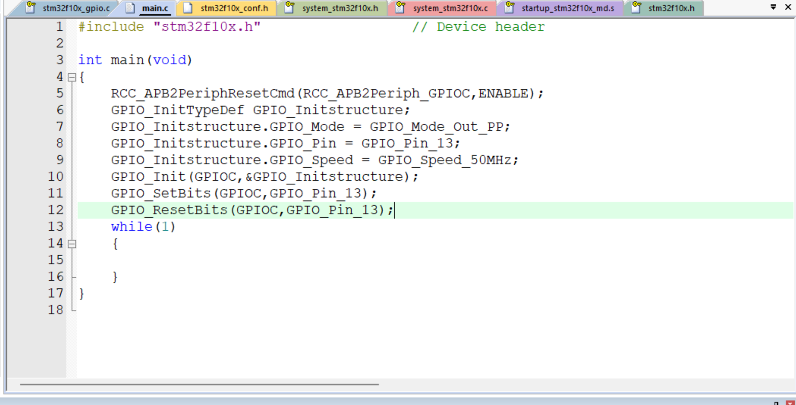

## 9.26
> 今日学习目标：STM32寄存器版GPIO点灯，熟悉Keil工程配置、ST‑Link烧录接线

### 一.今日完成学习项目
1. 看懂STM32寄存器点灯完整代码，理解RCC、GPIO相关寄存器作用
2. 排查Keil工程Flash下载报错，修改工程路径完成工程配置
3. 学习ST‑Link仿真器、杜邦线接线方式，理清SWD烧录接线逻辑

### 二：取得核心技能：
1. 掌握STM32开发的基本流程：**开启外设时钟 → 配置引脚模式 → 控制引脚电平**，明白了RCC相当于外设的电源开关，GPIO用来控制芯片引出引脚。
```c
RCC->APB2ENR = 0x00000010;   // 开启GPIOC端口时钟
GPIOC->CRH   = 0x00300000;   // 配置PC13引脚为推挽输出
GPIOC->ODR   = 0x00002000;   // PC13输出高电平
```
# STM32寄存器点灯实验要点整理
理解寄存器赋值中十六进制`0x`数值的含义，本质是二进制位开关，1代表开启、0代表关闭，能够读懂每一行寄存器配置对应的硬件动作。

掌握PC13板载LED特性：高电平熄灭、低电平点亮，可修改ODR寄存器的值实现LED亮灭控制。

学会Keil工程基础配置：魔法棒选项勾选`Create HEX File`生成烧录文件，理解工程路径不能带有空格、中文。

## 三、遇到问题与解决方案
### 问题一
Keil 点击 Load 下载，报错 `Flash Download failed - Could not load file`
- 报错原因：工程文件夹名称带有空格，Keil 无法识别目标文件
- 解决方案：关闭 Keil，重命名工程文件夹，路径全部使用英文、数字、下划线；重新打开工程执行 Rebuild 编译，成功生成可下载文件。

### 问题二
杜邦线很难插进 ST‑Link 的排针
- 原因：杜邦线头类型不匹配、插接角度歪斜
- 解决方案：分清公头母头，ST‑Link 是金属公排针，需要母头杜邦线套上去；插头垂直对准，不要斜着硬怼，防止掰弯引脚。


---

## 9.29
### 1. 工程文件结构
- Library文件夹：ST官方提供的外设工具代码包。
  - stm32f10x_gpio.c：引脚控制工具；stm32f10x_rcc.c：外设电源控制工具；其余为串口、定时器等外设工具。
- User文件夹（用户操作台）
  - main.c：主程序文件，单片机上电从此处开始执行，编写业务逻辑。
  - stm32f10x_conf.h：库外设勾选清单，用来开启/关闭需要使用的外设库。
  - stm32f10x_it.c / stm32f10x_it.h：中断应急处理文件，点灯实验无需修改。
- startup_stm32f10x_md.s：启动汇编文件，单片机上电最先执行。

### 2. 宏定义 #define
宏定义是给复杂数字、寄存器地址起外号，编译前做文本替换。
作用：
1. 提升代码可读性，用易懂名字代替十六进制数字；
2. 修改参数只改一行，所有引用位置同步更新；
3. 充当代码开关，控制代码是否参与编译。
> Keil C/C++选项卡中 `USE_STDPERIPH_DRIVER` 是库函数工程总开关宏，定义后才会加载stm32f10x_conf.h，才能正常使用库函数。

### 3. Keil工程关键配置
1. Preprocessor Symbols：Define填写`USE_STDPERIPH_DRIVER`，启用标准外设库。
2. Include Paths：头文件搜索路径，告诉编译器去哪里查找.h头文件。
3. Optimization 优化等级 Level 0(-O0)：关闭代码优化，适合新手调试。
4. Output选项勾选Create HEX File：生成烧录用的hex文件。
> 工程存放路径不能包含中文、空格，否则下载会出现Flash Download failed报错。

### 4. 点灯代码逻辑
执行顺序口诀：**先开时钟，再配引脚，设置电平，循环停留**
1. `RCC_APB2PeriphClockCmd(RCC_APB2Periph_GPIOC, ENABLE);`
开启GPIOC外设时钟，给硬件模块上电。
⚠️ 区分：`RCC_APB2PeriphResetCmd`仅做外设复位（恢复出厂），**不能上电**。
2. GPIO_InitTypeDef：GPIO配置表格，填写引脚模式、引脚号、引脚速度；调用GPIO_Init使配置生效。
3. 引脚电平控制：
- GPIO_SetBits：输出高电平，PC13板载LED熄灭
- GPIO_ResetBits：输出低电平，PC13板载LED点亮
> PC13板载LED特性：高电平熄灭、低电平点亮
4. while(1)死循环：程序停留，维持当前引脚电平。

### 5. 实验踩坑记录
故障现象：代码编译无报错，下载后LED不亮
根本原因：只写外设复位函数，**没有开启GPIOC外设时钟**，外设断电，所有GPIO配置无效。
附加坑：单片机运行速度极快，连续切换高低电平，变化太快，人眼无法观察灯光变化。

### 6. 底层基础概念
寄存器本质：二进制位开关，1代表开启，0代表关闭，通过读写寄存器可以直接控制硬件。


