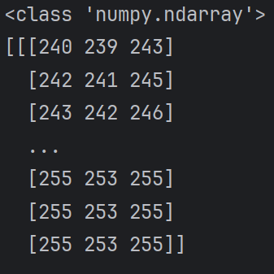

## 9.23

> 今日学习目标：安装opencv，了解机器学习基本概念

### 一. 今日完成学习项目
1. 在pycharm环境下，安装opencv
2. 理解图片数据读取基本原理
3. 通过cv2模块，实现基本读图操作

### 二. 取得核心技能：
1. 理解机器视觉下，彩色图片以像素点为单位，通过三原色的灰度值组成的矩阵表示
2. 可以正确读取图片的数据
```python
img=cv2.imread('./img.png')
```



3. 可以正确显示图片
```python
cv2.show('image',img)   
cv2.waitKey(0)     
cv2.destroyAllWindows()
```
4. 其他基本操作
```python
print(img.shape)   #表示长 宽 彩色（3）  
  
img2=cv2.imread('./img.png',cv2.IMREAD_GRAYSCALE) #灰度图转换
cv2.imwrite('./img2.png',img2)  #保存图像  
img.size   #像素大小  
img.dtype   #数据类型：因为只有0-255 因此uint8就够了
```
### 三. 遇到问题与解决方案
**问题一：opencv安装速度极慢**
**-解决方案：** 通过手动更改软件包为 https://pypi.tuna.tsinghua.edu.cn/simple 完成安装


# 9.24

> 今日学习目标：学习基本的视频处理操作

### 一. 今日完成学习项目
1. 了解如何捕获摄像头，了解视频由图片组成，并且进行基本视频处理

### 二. 取得核心技能：
1. 理解机器视觉下，视频是由很多图片组成
2. 可以正确捕获摄像头，并进行诸如灰度图转化的处理
```python
while open:  
    ret,frame=vc.read()  
    if frame is  None:  
        break  
    if ret:  
        gray=cv2.cvtColor(frame,cv2.COLOR_BGR2GRAY) #转为灰度图  
        cv2.imshow('result',gray)  
        if cv2.waitKey(10) & 0xFF == ord('q'):   #按q退出  
            break  
vc.release()  
cv2.destroyAllWindows()
```

# 9.25

> 今日学习目标：学习基本的图片计算操作

### 一. 今日完成学习项目
1. 了解如何截取屏幕，提取RGB，通过RGB进行融合，修改图片尺寸并进行加权融合

### 二. 取得核心技能：
1. 进行正确的截取屏幕操作
```python
img=cv2.imread('./img.png')  
new_img=img[100:300,100:300]    #长 宽截取
```

2. 可以正确拆出三原色并实现反向融合
```python
b,g,r=cv2.split(img)    
#b,g,r的三者shape一样
img=cv2.merge([b,g,r])
```

3. 理解图片实现融合需要尺寸一致，通过resize正确修改尺寸并进行加权融合
```python
img2=cv2.resize(img2,target_shape)  
  
result=cv2.addWeighted(img,0.5,img2,0.3,0)
```

# 9.26
### 一. 今日完成学习项目
1. 对图片进行多种阈值操作

### 二. 取得核心技能：
1. 可以正确利用threshold函数取图片阈值，这位后续的机器识别打下基础
```python
#超过thresh部分取marval 否则取0 ret接收阈值  
ret,thresh1=cv2.threshold(img,127,255,cv2.THRESH_BINARY)  
#上一个反向操作  
ret,thresh2=cv2.threshold(img,127,255,cv2.THRESH_BINARY_INV)  
#超过阈值部分取阈值 其余不变  
ret,thresh3=cv2.threshold(img,127,255,cv2.THRESH_TRUNC)  
#超过阈值部分不变 其余为0  
ret,thresh4=cv2.threshold(img,127,255,cv2.THRESH_TOZERO)  
#上一个反向操作  
ret,thresh5=cv2.threshold(img,127,255,cv2.THRESH_TOZERO_INV)
```


# 9.27
### 一. 今日完成学习项目
1. 理解对图片进行平滑处理的意义
2. 理解各自平滑处理的方法和原理
### 二. 取得核心技能：
1. 认识到平滑处理的作用：去除噪音点
2. 认识到平滑处理的原理：通过滤波进行卷积操作
3. 体验了几种常见滤波
```python
#均值滤波：  
blur=cv2.blur(img,(5,5))    #一个核（kernel）的大小 一般是奇数  
  
#方框滤波：和均值一样 区别是可以不归一化  
ox=cv2.boxFilter(img,-1,(3,3),normalize=True) #
  
#但上述两种方法可能会导致图片曝光整体变高  
  
#高斯滤波：赋予权重 越接近中间的权重越大  
#sigmax越小 边缘细节越清晰 但是去噪效果越差  为0则自动计算  
aussain=cv2.GaussianBlur(img,(5,5),0)  
  
#中值滤波：取方框中间值代替  
median=cv2.medianBlur(img,5)
```

# 9.28

### 一. 今日完成学习项目
1. 学习各种图像形态学操作，以实现对竞赛中物块图像预处理后的图片进行突出、降噪作用
### 二. 取得核心技能：
1. 理解腐蚀原理、以及去噪突出的作用，并且体验图片腐蚀
```python
kernel = np.ones((5,5),np.uint8)    #设置一个核  
erosion=cv2.erode(before_erosion,kernel,iterations=1)
```


2. 理解膨胀作用原理（与腐蚀相反），并且通过膨胀弥补腐蚀带来的主体轮廓损失
```python
before_dilation=cv2.imread("./afterErosion.png")  
after_dilation=cv2.dilate(before_dilation,kernel,iterations=1)
```


3. 认识到开运算和闭运算：开运算是先腐蚀再膨胀，闭运算是先膨胀再腐蚀
	前者用于去除白点，后者用于补全轮廓
```python
opening=cv2.morphologyEx(img,cv2.MORPH_OPEN,kernel)  
closing=cv2.morphologyEx(img,cv2.MORPH_CLOSE,kernel)
```
4. 认识梯度计算是膨胀减去腐蚀，也就是提取边界
```python
gradient=cv2.morphologyEx(img,cv2.MORPH_GRADIENT,kernel)
```


5. 认识礼帽和黑帽的不同作用，并且体验它
礼帽用于提取细小噪点，黑帽用于提取膨胀的填充部分
```python
tophat=cv2.morphologyEx(res,cv2.MORPH_TOPHAT,kernel)  
blackhat=cv2.morphologyEx(res,cv2.MORPH_BLACKHAT,kernel)
```

# 9.29
### 一. 今日完成学习项目
1. 学习计算图像梯度
### 二. 取得核心技能：
1. 理解sobel算子：分为左右（x）上下（y）部分，利用算子（近处大，远处小；右减左，下减上），本质是求导，找到变化率大的部分（检测边缘）
2. 理解sobel中负数截断操作，并且利用CV_64F和取绝对值保留了负数部分
3. 对比了分别进行x和y计算再相加，与直接计算的区别,其中前者图片更清晰
```python
sobelx=cv2.Sobel(img,cv2.CV_64F,1,0,ksize=5)
sobelx=cv2.convertScaleAbs(sobelx)  
sobely=cv2.Sobel(img,cv2.CV_64F,0,1,ksize=5)  
sobely=cv2.convertScaleAbs(sobely)  #同理  
sobelxy=cv2.addWeighted(sobelx,0.5,sobely,0.5,0)
```


```python
sobel=cv2.Sobel(img,cv2.CV_64F,1,1,ksize=5)
```


4. 了解其他算子，如Scharr和laplacian算子的存在

# 9.30
### 一. 今日完成学习项目
1. 学习通过canny算法，进行边缘检测
### 二. 取得核心技能：
	
1. 正确理解canny检测的流程：
		高斯滤波平滑图像->sobel算子得到粗边界->非极大值抑制获得细边界->双阈值检测
 
2. 正确使用并且对比了maxVal,minVal的不同：两者越大边界越不明显


# 10.1
### 一. 今日完成学习项目
1. 学习轮廓检测，轮廓绘制
### 二. 取得核心技能：
1. 了解findcontours的使用方法，并且成功提取出轮廓
```python
img=cv2.imread("square.jpg",cv2.IMREAD_GRAYSCALE) #要在二值环境进行  
ret,thresh=cv2.threshold(img,127,255,cv2.THRESH_BINARY)  
contours,hierarchy=cv2.findContours(thresh,cv2.RETR_TREE,cv2.CHAIN_APPROX_SIMPLE)  
```
2. 绘制出带框的图
```python
cv2.drawContours(img,contours,-1,(0,255,0),2)
```

### 三. 遇到问题与解决方案
**问题一：** 使用白色纸片进行测试，发现计算机无法区分其与桌子的差别，竞赛中白色地胶地板找白色方块，可能会出现类似问题
**-解决方案：** 将在programming_design_log中，将详细描述核心方法和调试过程