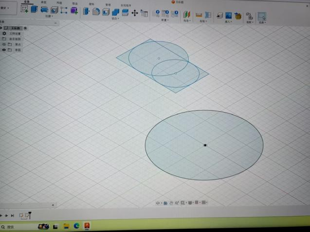
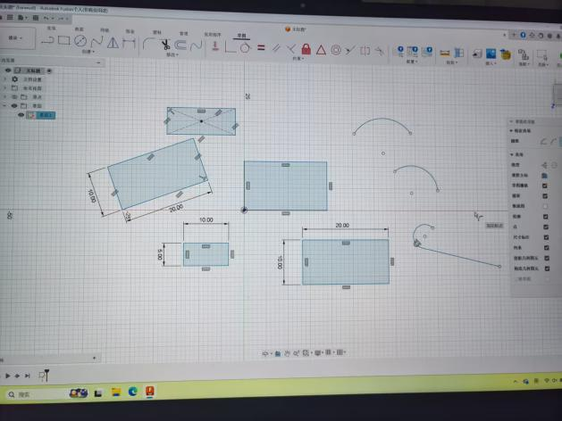
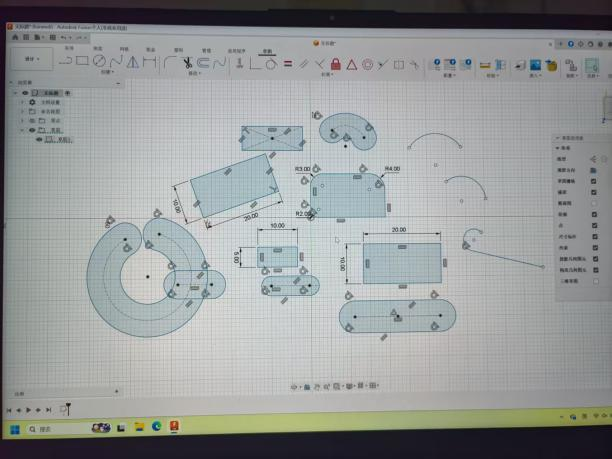
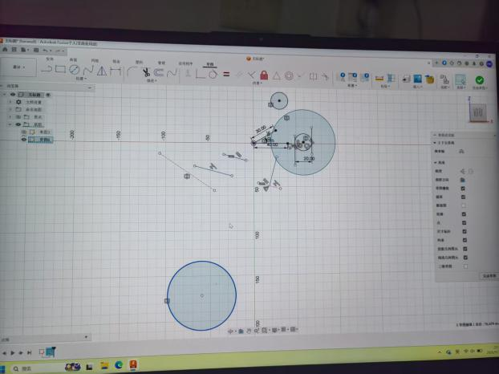
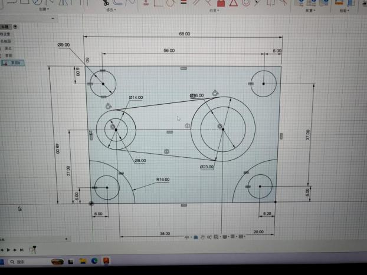
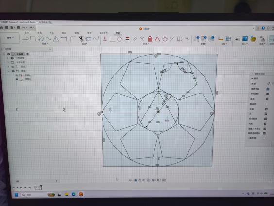
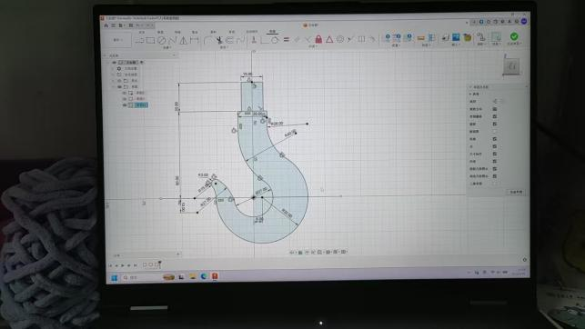

# 本周进度
本周我初步学习了solidworks的零件的基本用法，能够独立绘制草图或临摹其他复杂草图.
## 第一课：初试

## 第二课：基本绘图方法及捷径

快捷方式还是右键长按最自在
那什么投影作图没听太懂，需要进一步的练习，多见题型就好了

## 第三课：独立绘制草图练习对比原图的作图流程很痛苦，但我是唯结果论，不同的路线能够呈现同样的效果吧

# 9.22学习进度
## 1.自己照着草图搓了一个枪哈哈

## 2.学习了拉伸凸台基体等技巧

## 3.学习如何构建旋转凸台基体，以及弹簧的绘制

发现比赛官方更推荐fusion360,遂决定暂时搁置对solidworks的学习，以后有时间就两个一起学吧

# 9月25日fusion360进度
## 1.初学绘制草图，与solidworks如出一辙，非常简单

## 2画几个草图来练手

Fusion360难受死了，什么叫用了矩阵就没法标注尺寸？不标尺寸谁知道我是用的矩阵还是随便画几个圆杵在那里?

红温了总结fusion缺点：不严谨，在多个草图图案部分重合时，无法精确选出某个图案，比如两个点你不知道它是否重合，你也选不出来其中一个点，显示你的草图处于未完成状态，你也无法直接看出到底哪里未约束
