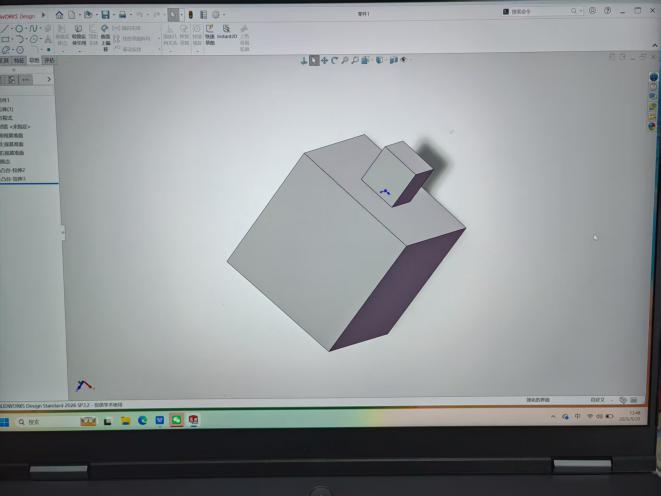
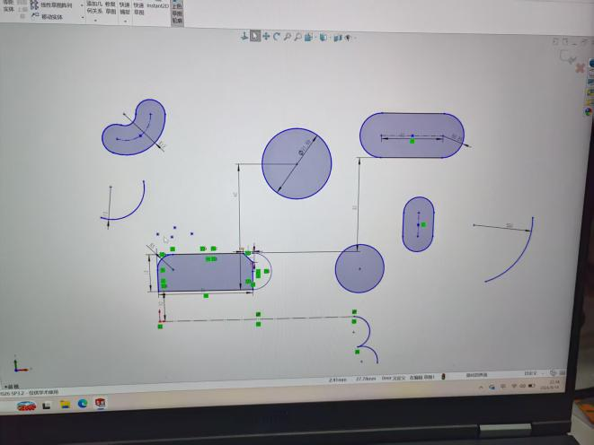
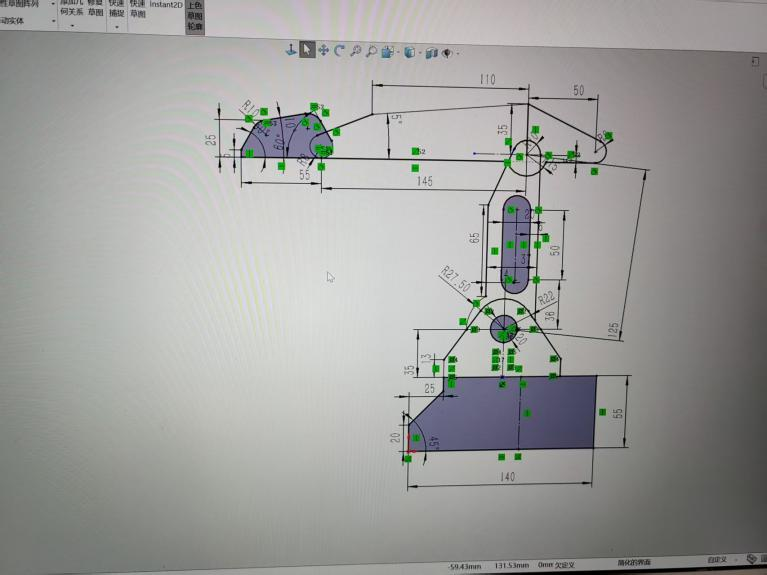
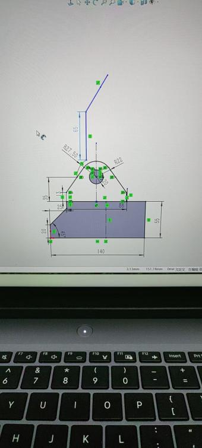
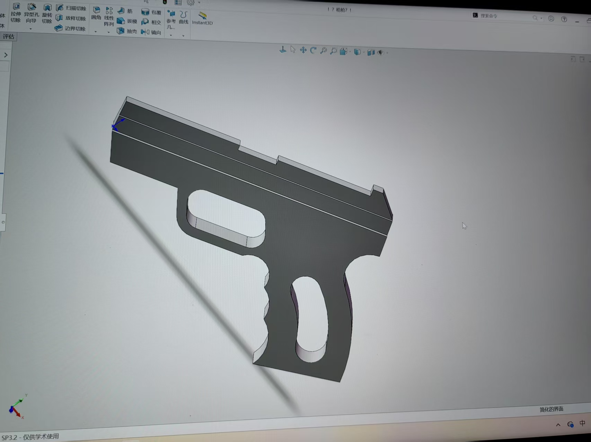
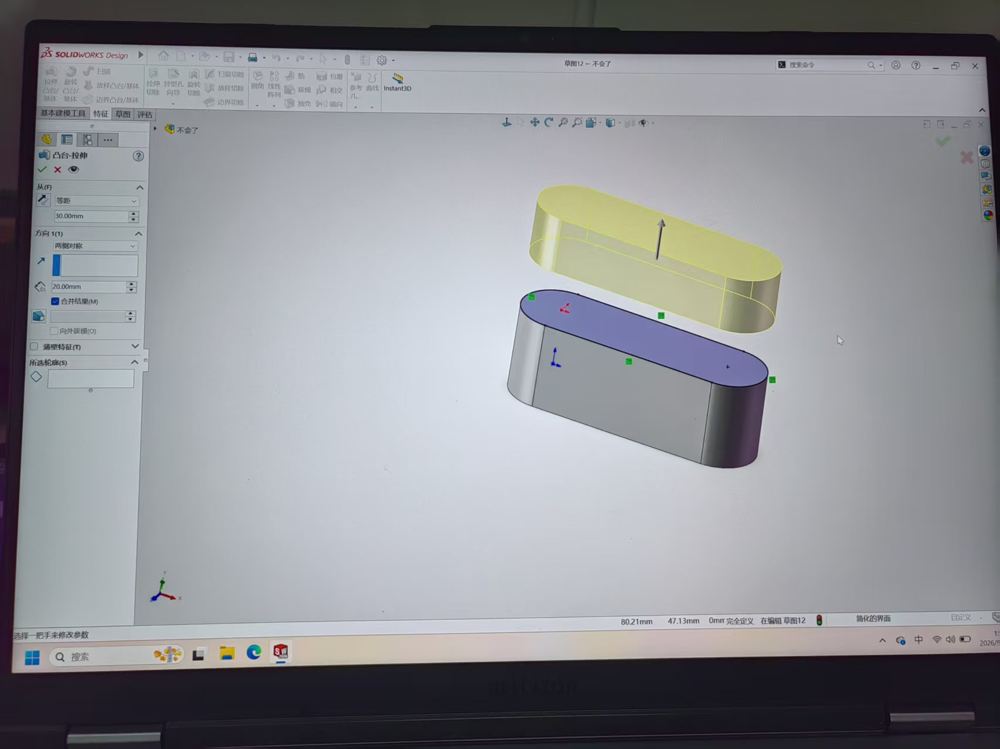
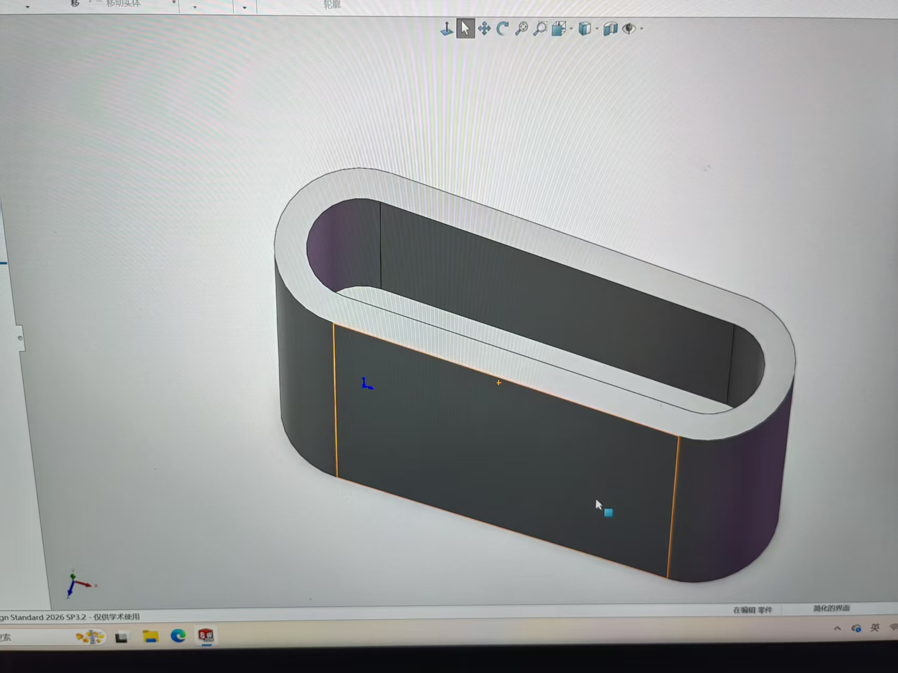
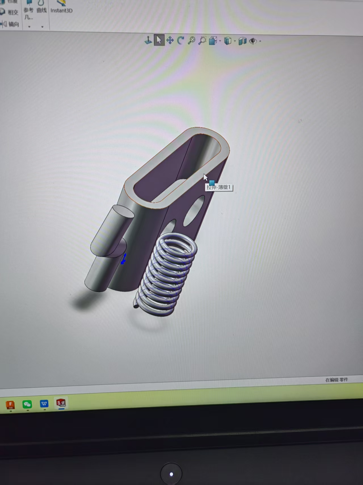

# 本周进度
本周我初步学习了solidworks的零件的基本用法，能够独立绘制草图或临摹其他复杂草图.
## 第一课：初试

## 第二课：基本绘图方法及捷径

快捷方式还是右键长按最自在
那什么投影作图没听太懂，需要进一步的练习，多见题型就好了

## 第三课：独立绘制草图练习对比原图的作图流程很痛苦，但我是唯结果论，不同的路线能够呈现同样的效果吧

# 9.22学习进度
## 1.自己照着草图搓了一个枪哈哈

## 2.学习了拉伸凸台基体等技巧

## 3.学习如何构建旋转凸台基体，以及弹簧的绘制

发现比赛官方更推荐fusion360,遂决定暂时搁置对solidworks的学习，以后有时间就两个一起学吧
