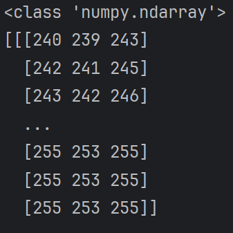

## 9.23

> 今日学习目标：安装opencv，了解机器学习基本概念

### 一. 今日完成学习项目
1. 在pycharm环境下，安装opencv
2. 理解图片数据读取基本原理
3. 通过cv2模块，实现基本读图操作

### 二：取得核心技能：
1. 理解机器视觉下，彩色图片以像素点为单位，通过三原色的灰度值组成的矩阵表示
2. 可以正确读取图片的数据
```python
img=cv2.imread('./img.png')
```




3. 可以正确显示图片
```python
cv2.show('image',img)   
cv2.waitKey(0)     
cv2.destroyAllWindows()
```
4. 其他基本操作
```python
print(img.shape)   #表示长 宽 彩色（3）  
  
img2=cv2.imread('./img.png',cv2.IMREAD_GRAYSCALE) #灰度图转换
cv2.imwrite('./img2.png',img2)  #保存图像  
img.size   #像素大小  
img.dtype   #数据类型：因为只有0-255 因此uint8就够了
```
### 三. 遇到问题与解决方案
**问题一：opencv安装速度极慢**
**-解决方案：** 通过手动更改软件包为 https://pypi.tuna.tsinghua.edu.cn/simple 完成安装
