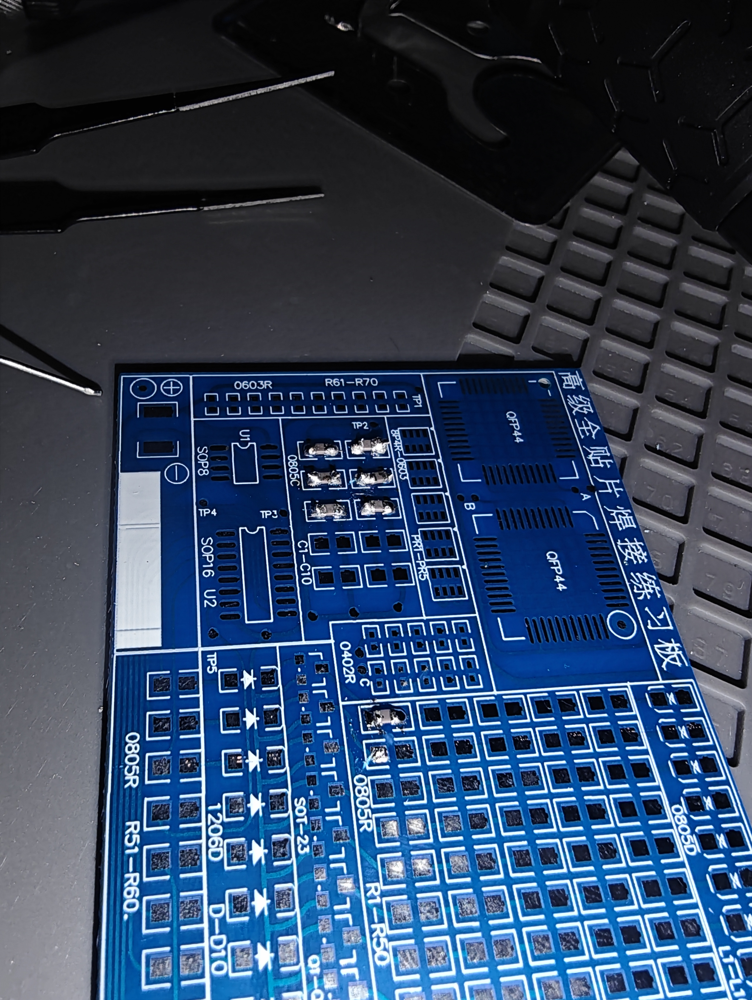
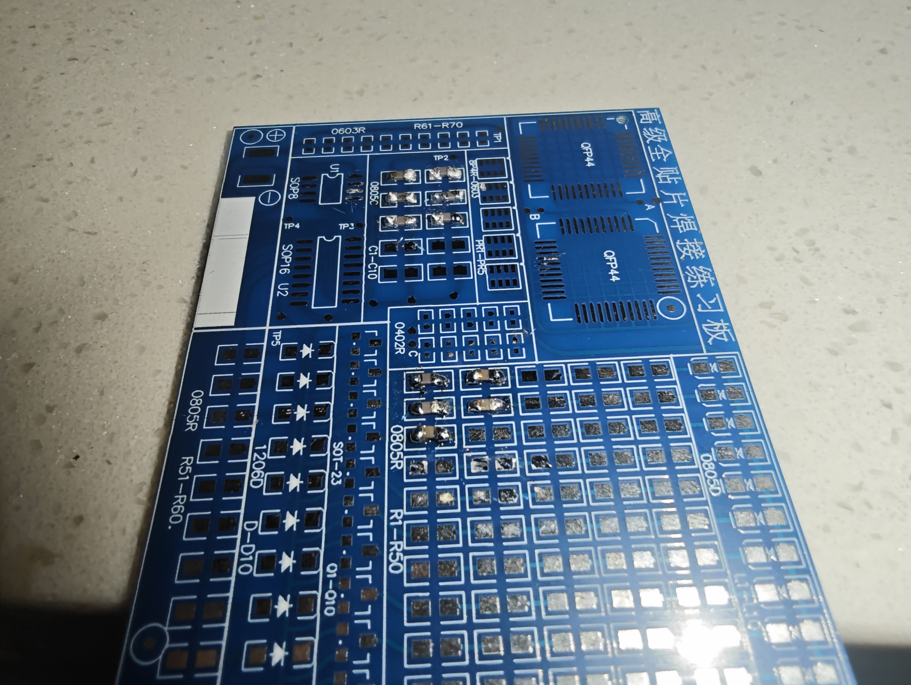
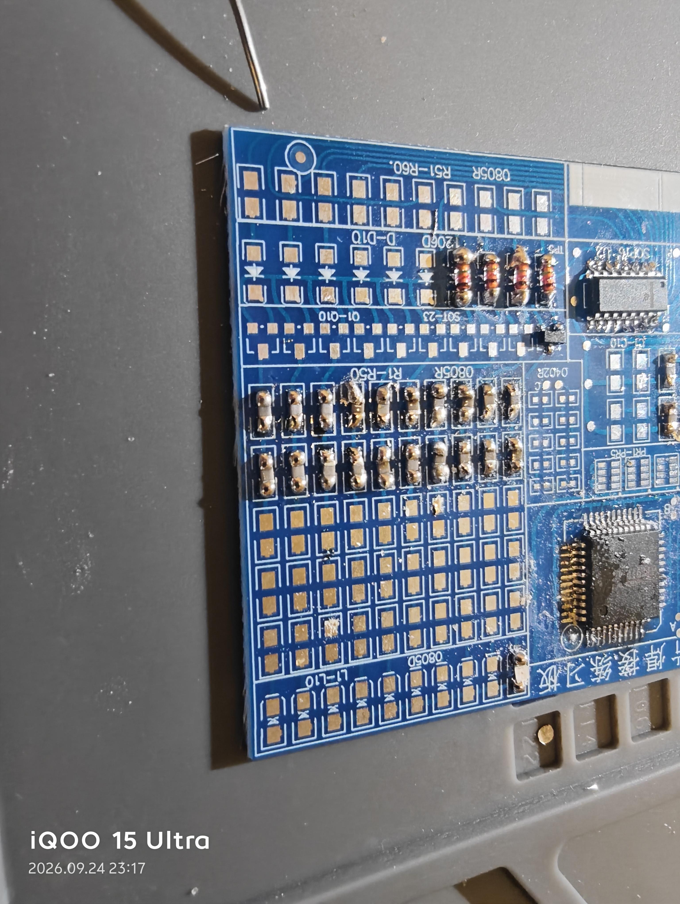
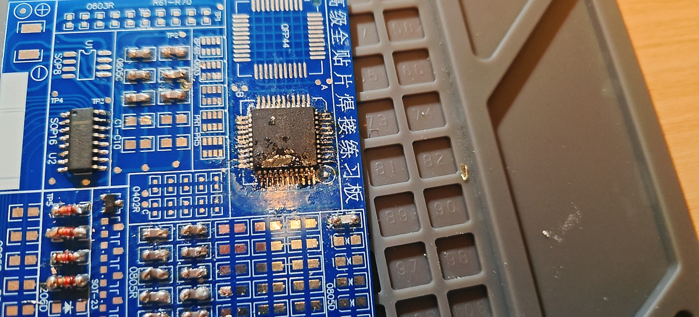

# 贴片焊接练习学习总结

## 一、练习内容

| 元件类型 | 封装 | 要点 |
|---|---|---|
| 贴片电阻 | 0805 | 无极性，焊点均匀即可 |
| 贴片LED | 0805 / 1206 | 有极性，标记端对负极焊盘 |
| 开关二极管 | LL34（1206） | 黑环端为负极，对PCB竖线标记 |
| 双二极管 | SOT-23（丝印JB） | 3引脚，标记角对PCB圆点 |
| 芯片IC | SOP8 / SOP16 | 缺口/圆点对PCB凹口（1脚） |
| 芯片IC | QFP44 | 四角定位，四面拖焊 |

## 二、已掌握

- 各类元件极性与方向识别方法
- "先固定一脚、校正后批量焊接"的标准流程
- 助焊剂使用与连锡基础处理

## 三、待改进

- QFP44密引脚拖焊锡量控制不足，易连锡
- 个别焊点偏多锡，存在虚焊隐患
- 0402超小元件尚未练习

## 四、核心口诀

> 电阻无正反，LED二极管看标记；
> SOP、QFP圆点对缺口，标记就是1脚；
> 密脚多助焊，少堆锡，烙铁不要久停留。

